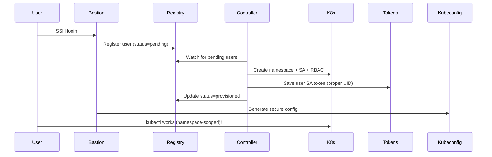

# Kubernetes Operator for PyTorch Development Servers

## Project Overview
Build a Kubernetes operator to manage development servers for developers on AWS EKS, supporting both standalone development and distributed PyTorch training. Users access the platform through a centralized bastion server that provides a secure, audited interface to the Kubernetes cluster. The operator will be built using Golang Operator SDK (Kubebuilder) and integrated with Kueue for resource quotas.

## Core Requirements

### Infrastructure
- **Platform**: AWS EKS
- **Operator Framework**: Golang Operator SDK (Kubebuilder)
- **Resource Management**: Kueue for quotas
- **Access Method**: Centralized bastion server with SSH access
- **Storage**:
  - Persistent volumes for user home directories (`/home/dev/`) - uses cluster's default storage class
  - Planned: EBS volumes and EFS shared volumes (Phase 5/6)
- **ML Framework**: PyTorch only

### Key Features
1. **Resource Flavors**: Predefined configurations (GPU types, memory, CPU)
2. **Distributed Training**: Support PyTorch distributed training with multiple replicas
3. **Lifecycle Management**: Create, update, delete, auto-shutdown
4. **User Isolation**: Per-user namespaces with RBAC
5. **Persistent Storage**: Home directories preserved across restarts

## Architecture Design

### Bastion Server Access

Users access the development server platform through a centralized bastion server:

- **SSH Entry Point**: Users SSH to `bastion.devservers.company.com`
- **Python CLI**: The `devctl` CLI is pre-installed on the bastion server
- **Namespace Isolation**: Each user is automatically scoped to their `dev-<username>` namespace
- **Secure kubectl Access**: Users receive namespace-scoped kubectl credentials (limited permissions)
- **Audit Trail**: All commands are logged centrally for security and compliance

```bash
# User workflow
ssh username@bastion.devservers.company.com
devctl create mydev gpu-large
devctl ssh mydev

# Users also have secure kubectl access
kubectl get pods -n dev-username    # ✅ Works - user's namespace
kubectl create namespace test       # ❌ Forbidden - security enforced
```

**Security Benefits:**
- Single point of access control
- Namespace-scoped kubectl credentials (limited to `dev-<username>`)
- Centralized command auditing
- Network isolation of development servers
- Automated user namespace management
- Zero-trust security model (users cannot escalate privileges)

### Custom Resource Definitions (CRDs)

#### DevServer CRD
```yaml
apiVersion: devservers.io/v1
kind: DevServer
metadata:
  name: <server-name>
  namespace: dev-<username>
spec:
  owner: <user>@company.com
  flavor: gpu-large  # References DevServerFlavor
  image: company/pytorch-dev:latest
  mode: standalone  # or distributed

  # For distributed training only
  distributed:
    worldSize: 4
    nprocsPerNode: 1
    backend: nccl
    ncclSettings:
      NCCL_DEBUG: INFO
      NCCL_SOCKET_IFNAME: eth0

  persistentHomeSize: 100Gi
  sharedVolumeClaimName: <username>-shared-efs
  enableSSH: true

  lifecycle:
    idleTimeout: 3600
    autoShutdown: true
    # Phase 4 additions:
    expirationTime: "2024-01-15T18:00:00Z"  # Auto-expire at specific time
    timeToLive: "4h"                        # Human-readable expiration from creation
```

#### DevServerFlavor CRD
```yaml
apiVersion: devservers.io/v1
kind: DevServerFlavor
metadata:
  name: gpu-large
spec:
  resources:
    requests:
      memory: 32Gi
      cpu: 8
      nvidia.com/gpu: 1
    limits:
      memory: 64Gi
      cpu: 16
      nvidia.com/gpu: 1
  nodeSelector:
    instance-type: g4dn.xlarge
```

### Kubernetes Resources Created

#### For Standalone Mode (Phase 3 ✅)
- **Deployment**: Single development server with sleep infinity
- **PVC**: Home directory (using cluster's default storage class)
- **Service**: For SSH/port access
- **ConfigMap**: Planned for PyTorch utility scripts

#### For Distributed Mode (Phase 6 - Planned)
- **StatefulSet**: Ordered pods for training nodes
- **Headless Service**: Pod discovery for PyTorch
- **ConfigMap**: PyTorch utility scripts
- **PVC**: Home directory per pod (planned EBS)
- **PVC**: Shared volume across all pods (planned EFS)

## Phase 2 Architecture: Secure User Provisioning

### User Controller Sidecar Pattern

Phase 2 implements a secure user provisioning system using a sidecar controller pattern:

```yaml
apiVersion: apps/v1
kind: Deployment
metadata:
  name: bastion
spec:
  template:
    spec:
      containers:
      - name: bastion           # SSH server + user registration
        image: devserver/bastion:phase2
        volumeMounts:
        - name: shared-data
          mountPath: /shared
      
      - name: user-controller   # Secure resource provisioning
        image: devserver/bastion:phase2
        command: ["python3", "/usr/local/bin/user-controller.py"]
        volumeMounts:
        - name: shared-data
          mountPath: /shared
      
      volumes:
      - name: shared-data
        emptyDir: {}
```

### Security Model

**Controller Permissions (Elevated)**:
- Create namespaces (restricted to `dev-*` pattern)
- Create ServiceAccounts and RBAC roles
- Generate user tokens

**User Permissions (Limited)**:
- Access only their `dev-<username>` namespace
- Manage pods, services, PVCs within their namespace
- **Cannot** create namespaces or access cluster-wide resources

### User Provisioning Flow



### Resources Created Per User

**Namespace**: `dev-<username>`
```yaml
apiVersion: v1
kind: Namespace
metadata:
  name: dev-<username>
  labels:
    devserver.io/user: "<username>"
    devserver.io/created-by: "user-controller"
```

**ServiceAccount**: `user-<username>`
```yaml
apiVersion: v1
kind: ServiceAccount
metadata:
  name: user-<username>
  namespace: dev-<username>
```

**Role**: Namespace-scoped permissions
```yaml
apiVersion: rbac.authorization.k8s.io/v1
kind: Role
metadata:
  name: dev-user
  namespace: dev-<username>
rules:
- apiGroups: [""]
  resources: ["pods", "services", "persistentvolumeclaims", "configmaps", "secrets"]
  verbs: ["get", "list", "create", "update", "patch", "delete"]
- apiGroups: ["apps"]
  resources: ["deployments", "statefulsets", "replicasets"]
  verbs: ["get", "list", "create", "update", "patch", "delete"]
```

**User Kubeconfig**: Secure, namespace-scoped access
```yaml
apiVersion: v1
kind: Config
contexts:
- context:
    cluster: default-cluster
    namespace: dev-<username>
    user: user-<username>
users:
- name: user-<username>
  user:
    tokenFile: /shared/user-tokens/<username>/token  # User-owned file
```

## Implementation Plan

### Phase 1: Bastion Infrastructure ✅ COMPLETED
**Status**: All objectives completed successfully with enhanced automation

**Completed Deliverables**:
1. ✅ Build bastion container image with Python CLI (`devctl`)
2. ✅ Deploy bastion server with HA configuration (2 replicas)
3. ✅ Setup SSH authentication and user management (with auto-generated demo keys)
4. ✅ Configure Network Load Balancer and DNS (AWS NLB support + local port-forward)
5. ✅ Test user onboarding and basic CLI access (full end-to-end testing)

**Additional Achievements**:
- ✅ Environment-aware deployment (k3d, kind, minikube, EKS auto-detection)
- ✅ Automated SSH key generation and injection for testing
- ✅ Cross-platform compatibility (macOS/Linux)
- ✅ Automated cleanup and deployment workflows
- ✅ Comprehensive error handling and troubleshooting
- ✅ Repeatable developer experience with one-command workflow

### Phase 2: Secure User Provisioning ✅ COMPLETED
**Status**: All objectives completed successfully with enhanced security model

**Completed Deliverables**:
1. ✅ User Controller Sidecar - Automatic namespace and ServiceAccount provisioning
2. ✅ Secure kubectl Access - Users get namespace-scoped credentials (no cluster access)
3. ✅ Zero-Trust Security Model - Users cannot create namespaces or access other namespaces
4. ✅ Enhanced CLI - Security-appropriate connectivity tests and Phase 2 capabilities
5. ✅ Comprehensive Testing - Full end-to-end validation with timeout handling

**Security Architecture Implemented**:
- ✅ **Separated RBAC**: Controller SA (cluster permissions) vs User SA (namespace-scoped)
- ✅ **Automatic User Provisioning**: `dev-<username>` namespace + `user-<username>` ServiceAccount
- ✅ **Token Permission Fix**: User-owned token files with proper UID ownership
- ✅ **Namespace Isolation**: Users can only access their own development namespace
- ✅ **Sidecar Pattern**: User controller runs alongside bastion for secure provisioning

**Technical Implementation**:
- ✅ User Controller Python sidecar container
- ✅ Shared volume communication between bastion and controller
- ✅ User registry JSON tracking and status management
- ✅ Enhanced entrypoint with user registration and secure kubeconfig generation
- ✅ Security-aware devctl CLI with proper connectivity testing

### Phase 3: DevServer Operator & CRDs ✅ COMPLETED
**Status**: All objectives completed successfully with enterprise-grade operator and user experience

**Completed Deliverables**:
1. ✅ Setup Golang Operator SDK (Kubebuilder) project structure
2. ✅ Create comprehensive CRDs (DevServer, DevServerFlavor) with full Go structs and validation
3. ✅ Implement standalone server creation/deletion with robust reconciliation logic
4. ✅ Persistent volume provisioning with proper PVC management
5. ✅ Smart container lifecycle management (auto-injection of sleep infinity)
6. ✅ Error-free reconciliation loops with proper resource handling
7. ✅ **Complete devctl CLI with modular architecture and full DevServer lifecycle management**
8. ✅ **Cluster-scoped DevServerFlavors with automatic default creation**
9. ✅ **Enhanced RBAC with pods/exec permissions for container access**
10. ✅ **Production-ready user workflow from SSH to DevServer management**

**Technical Achievements**:
- ✅ **Enterprise Resource Management**: Cluster-scoped DevServerFlavors with automatic defaults (cpu-small, cpu-medium, cpu-large)
- ✅ **Modular CLI Architecture**: Separated into commands, api, ui, config modules for maintainability
- ✅ **Complete User Experience**: devctl create, list, describe, delete, exec, ssh, flavors - all working seamlessly
- ✅ **Production-Ready Reconciliation**: Proper finalizers, owner references, and error handling
- ✅ **Smart Resource Management**: Immutable PVC handling, deployment updates, service management
- ✅ **Container Lifecycle**: Auto-injection of sleep commands for any base image with full container access
- ✅ **Enhanced Security Model**: Proper RBAC for cluster-scoped resources with namespace isolation
- ✅ **Local Development**: Optimized for k3d clusters with appropriate resource sizing and environment detection
- ✅ **Status Management**: Real-time status updates with phase tracking and SSH endpoints

### Phase 4: Advanced Lifecycle & Flavor Management
1. **Auto-expiration and lifecycle management implementation**
2. **DevServer flavor updates without persistent volume disruption**
3. Enhanced monitoring and resource usage tracking
4. Cost optimization features and idle detection improvements
5. User notification systems for expiration warnings

#### New Phase 4 Features in Detail

**Auto-Expiration and Lifecycle Management**:
- Implement idle detection based on SSH connections, CPU usage, and process activity
- Add `--time` flag to `devctl create` supporting human-readable formats (`30m`, `1h`, `2h30m`, `1d`)
- Auto-shutdown functionality when expiration time is reached
- `devctl extend` command to extend expiration time for running DevServers
- Cost optimization through automatic resource cleanup
- Configurable grace periods and warning notifications before shutdown

**DevServer Flavor Updates Without Storage Disruption**:
- `devctl update <name> --flavor <new-flavor>` command for in-place hardware scaling
- Preserve persistent volumes (home directories and shared storage) during flavor changes
- Rolling update strategy for zero-downtime transitions
- Validation to ensure new flavor is compatible with existing storage
- Support for both scale-up and scale-down scenarios
- Automatic resource constraint validation and user warnings

### Phase 5: AWS Production Implementation (Weeks 7-8)
1. EBS CSI driver integration for persistent home directories
2. EFS CSI driver integration for shared volumes across DevServers
3. GPU node support and NVIDIA device plugin configuration
4. AWS-specific DevServerFlavors (GPU types: p3, p4, g4dn, etc.)
5. Network Load Balancer configuration for bastion access
6. ECR integration for container registry
7. AWS IAM integration for authentication
8. Cost tracking and AWS CloudWatch integration
9. Production networking and VPC configuration

### Phase 6: Distributed Training & Advanced Features (Weeks 9-10)
1. Add distributed mode to DevServer CRD
2. Implement StatefulSet creation for distributed PyTorch training
3. Configure PyTorch environment variables and NCCL settings
4. Add headless service for pod discovery
5. Create PyTorch utility scripts ConfigMap
6. Integration with Kueue for resource quotas
7. Advanced monitoring and training job management

### Phase 7: Production Readiness (Weeks 11-12)
1. Add comprehensive error handling and monitoring
2. Implement health checks and recovery mechanisms
3. Setup logging and monitoring (Prometheus/Grafana)
4. Security hardening and penetration testing
5. Cost tracking and capacity planning dashboards
6. Documentation and training materials

## Project Structure

```
devserver/                 # ✅ Phase 1 & 2 COMPLETED
├── bastion/               # ✅ Phase 2 - Secure User Provisioning
│   ├── Dockerfile          # Multi-stage container (Phase 2: SSH + user-controller)
│   ├── entrypoint.sh       # Enhanced: User registration + secure kubeconfig
│   ├── user-controller.py  # ✅ NEW - Sidecar for secure resource provisioning
│   ├── config/
│   │   ├── motd           # Welcome message
│   │   ├── sshd_config    # SSH security hardening
│   │   └── profile.d/
│   │       └── devserver.sh # User environment setup
│   └── k8s/               # Phase 2 - Enhanced Kubernetes manifests
│       ├── namespace.yaml  # Isolated namespace
│       ├── rbac.yaml      # ✅ UPDATED - Separated controller vs user permissions
│       ├── deployment.yaml # ✅ UPDATED - Sidecar pattern (bastion + user-controller)
│       └── service.yaml   # LoadBalancer with AWS NLB annotations
├── cli/                   # ✅ Phase 3 - Complete DevServer Management CLI
│   ├── devctl/
│   │   ├── main.py        # ✅ UPDATED - Modular CLI with complete DevServer lifecycle
│   │   ├── commands/      # ✅ NEW - Separated command modules
│   │   │   ├── status.py  # Environment and DevServer status
│   │   │   ├── devserver.py # create, list, describe, delete, exec, ssh, flavors
│   │   │   ├── test.py    # Kubernetes connectivity and permission testing
│   │   │   └── info.py    # Help and command information
│   │   ├── api/           # ✅ NEW - Kubernetes API operations
│   │   │   ├── kubectl.py # kubectl wrapper utilities
│   │   │   └── devserver.py # DevServer and DevServerFlavor operations
│   │   ├── ui/            # ✅ NEW - Rich console utilities
│   │   │   └── console.py # Tables, panels, progress spinners
│   │   ├── config/        # ✅ NEW - Configuration and settings
│   │   │   └── settings.py # User context, defaults, environment detection
│   │   └── __init__.py
│   └── pyproject.toml     # Modern Python packaging
├── scripts/               # ✅ Phase 2 - Enhanced automation
│   ├── build-bastion.sh   # ✅ UPDATED - Phase 2 container build
│   ├── deploy-bastion.sh  # ✅ UPDATED - Phase 2 deployment
│   └── test-ssh.sh        # ✅ UPDATED - Comprehensive Phase 2 security testing
├── demo-keys/             # ✅ Auto-generated SSH keys for testing
├── CLAUDE.md              # ✅ UPDATED - Phase 2 architecture documentation
└── README.md

# Phase 3 ✅ COMPLETED:
devserver-operator/        # ✅ Phase 3 - DevServer CRDs and Operator (Golang)
├── api/
│   └── v1/
│       ├── devserver_types.go
│       ├── devserverflavor_types.go
│       ├── groupversion_info.go
│       └── zz_generated.deepcopy.go
├── config/
│   ├── crd/
│   │   ├── bases/
│   │   │   ├── devservers.io_devservers.yaml
│   │   │   └── devservers.io_devserverflavors.yaml
│   │   └── kustomization.yaml
│   ├── rbac/
│   │   ├── role.yaml
│   │   └── role_binding.yaml
│   ├── manager/
│   │   ├── controller_manager_config.yaml
│   │   └── kustomization.yaml
│   └── default/
│       └── kustomization.yaml
├── controllers/
│   ├── devserver_controller.go
│   └── devserverflavor_controller.go
├── internal/
│   ├── controller/
│   │   ├── standalone.go
│   │   ├── distributed.go
│   │   └── volumes.go
│   └── utils/
│       └── pytorch.go
├── main.go
├── go.mod
├── go.sum
├── Makefile
├── PROJECT
└── Dockerfile             # Operator image
```

## Phase 1 Implementation Summary

### What We Built ✅

**Complete Bastion Infrastructure**:
- SSH-accessible Ubuntu 22.04 container with OpenSSH hardening
- DevCtl CLI package installed via pip with proper pyproject.toml
- Kubernetes connectivity with service account and RBAC
- High availability deployment with 2 replicas and anti-affinity rules
- Health checks and readiness probes for production reliability

**Smart Deployment Automation**:
- Environment detection (k3d, kind, minikube, EKS) with appropriate handling
- Automatic SSH key generation for immediate testing
- Image loading for local clusters (k3d image import, kind load, etc.)
- Dynamic deployment patching (imagePullPolicy based on cluster type)
- Automated cleanup of existing resources before deployment

**Developer Experience**:
- One-command workflow: `build-bastion.sh` → `deploy-bastion.sh` → `test-ssh.sh`
- Auto-generated SSH keys stored in `.demo-keys/` for immediate testing
- End-to-end testing that validates SSH auth and CLI functionality
- Cross-platform compatibility (macOS/Linux) with proper error handling

**Production Ready Features**:
- AWS Network Load Balancer support with health check configuration
- Service account with minimal required permissions
- SSH security hardening and proper user environment setup
- Container security context properly configured for SSH daemon

### Phase 2 Implementation Summary

### What We Built ✅

**Secure User Provisioning Architecture**:
- User Controller sidecar for automatic namespace and ServiceAccount provisioning
- Separated RBAC model (controller vs user permissions)
- Secure token management with proper file ownership
- Enhanced CLI with security-appropriate connectivity tests
- Comprehensive end-to-end testing with timeout handling

**Security Model Achieved**:
- Zero-trust architecture: Users cannot escalate privileges
- Namespace isolation: Users limited to `dev-<username>` scope
- Automatic resource provisioning without manual intervention
- Audit trail through user registry and centralized logging

**Production Ready Features**:
- Resilient sidecar pattern with health checks
- Token permission fixes for multi-user scenarios
- Enhanced error handling and timeout management
- Cross-platform compatibility with environment detection

### Phase 3 Implementation Summary

### What We Built ✅

**Complete DevServer Operator Infrastructure**:
- Golang Operator SDK (Kubebuilder) project with clean architecture
- Comprehensive CRDs (DevServer, DevServerFlavor) with full validation and Go structs
- Production-ready reconciliation controller with proper error handling
- Smart resource management for PVCs, Deployments, and Services
- Container lifecycle management with auto-injection of sleep commands

**Enterprise-Grade Resource Management**:
- Cluster-scoped DevServerFlavors for centralized administration
- Automatic default flavor creation (cpu-small, cpu-medium, cpu-large)
- Enhanced RBAC model supporting both namespace and cluster-scoped resources
- Zero-duplication flavor management across user namespaces

**Complete User Experience (devctl CLI)**:
- Modular architecture with separated concerns (commands, api, ui, config)
- Full DevServer lifecycle: create, list, describe, delete, exec, ssh, flavors
- Beautiful Rich UI with tables, panels, and progress spinners
- Intelligent error handling and user guidance
- Real-time status tracking and container access

**Advanced Operator Features**:
- Immutable PVC spec handling to prevent reconciliation errors
- Owner reference management for proper resource cleanup
- Finalizer pattern for safe deletion and cleanup
- Real-time status tracking with phase and readiness indicators
- SSH endpoint provisioning for development server access

**Local Development Optimizations**:
- k3d cluster compatibility with appropriate resource sizing
- Auto-detection and handling of local storage classes
- Debug logging and comprehensive error reporting
- Bastion-style deployment scripts with environment detection

**Production Ready Features**:
- Clean reconciliation loops without error noise
- Proper Kubernetes API conventions and best practices
- Comprehensive RBAC with minimal required permissions for security
- Resource ownership and garbage collection
- Robust error handling and retry logic
- Complete user workflow validation from SSH to DevServer access

### Ready for Phase 5 🚀

The **complete development platform** is ready and provides:
- Production-ready operator with standalone server management
- Enterprise-grade user experience with intuitive CLI workflow
- Centralized resource management with cluster-scoped flavors
- Clean CRD architecture ready for distributed training extension
- Proven reconciliation patterns for complex resource management
- Validated end-to-end user workflow from bastion SSH to DevServer access
- Comprehensive security model with proper RBAC isolation

## CLI Commands

### Phase 2 Available Commands ✅

Users access the Python CLI through the bastion server via SSH:

```bash
# SSH to bastion server
ssh username@bastion.devservers.company.com

# Phase 2 - CLI is pre-installed and configured
devctl status        # Show environment status and kubectl connectivity
devctl info         # Show available commands and capabilities  
devctl test-k8s     # Test secure Kubernetes access and permissions
devctl --help       # Detailed help

# Phase 2 - Users also have secure kubectl access
kubectl get pods -n dev-username     # ✅ Works - user's namespace
kubectl create pod test -n dev-username  # ✅ Works - user can manage resources
kubectl get pods -n kube-system     # ❌ Forbidden - security enforced
kubectl create namespace test       # ❌ Forbidden - security enforced
```

### Phase 3 Current Commands (DevServer Operator) ✅

**Complete User Experience via Enhanced devctl CLI**:
```bash
# SSH to bastion server
ssh username@bastion.devservers.company.com

# Phase 3 - Complete DevServer lifecycle management
devctl status          # Show environment, DevServer status, and available flavors
devctl flavors         # List cluster-wide resource flavors (cpu-small, cpu-medium, cpu-large)
devctl create mydev --flavor cpu-small --wait  # Create dev server with progress tracking
devctl list            # List your development servers with status
devctl describe mydev  # Show detailed DevServer information and resources
devctl ssh mydev       # Interactive shell access to development server
devctl exec mydev -- python train.py  # Execute specific commands
devctl delete mydev    # Clean up development server
devctl test-k8s        # Test permissions including cluster-scoped flavor access

# Advanced usage
devctl create large-dev --flavor cpu-large --image pytorch/pytorch:latest --home-size 50Gi
devctl exec large-dev -- nvidia-smi  # For GPU-enabled flavors
```

**Behind the Scenes (Automatic)**:
```bash
# DevServerFlavors are automatically created cluster-wide during operator deployment:
# - cpu-small:  512Mi RAM, 0.5 CPU → 2Gi RAM, 2 CPU
# - cpu-medium: 2Gi RAM, 1 CPU → 8Gi RAM, 4 CPU  
# - cpu-large:  4Gi RAM, 2 CPU → 16Gi RAM, 8 CPU

# User gets automatic access to:
# - Namespace: dev-<username> 
# - DevServer CRUD operations in their namespace
# - Cluster-wide DevServerFlavor read access
# - pods/exec permissions for container access
```

### Future Phase 5 Commands (AWS Production)

```bash
# Future Phase 5 commands (coming with AWS production features)
devctl create mydev --flavor p3.2xlarge --home-size 500Gi  # AWS GPU instances with EBS
devctl create shared-dev --flavor g4dn.xlarge --shared-volume team-datasets  # With EFS shared storage
devctl create quick-test --flavor cpu-small --time 30m  # Auto-expire after 30 minutes
devctl create training-run --flavor p4d.24xlarge --time 4h  # Auto-expire after 4 hours
devctl update mydev --flavor p3.8xlarge  # Scale up hardware while keeping persistent volume
devctl flavors --aws          # Show AWS-specific GPU flavors
devctl cost mydev             # Cost tracking and usage monitoring
devctl extend mydev --time 2h # Extend expiration time for running DevServer
```

### Future Phase 6 Commands (Distributed Training)

```bash
# Future Phase 6 commands (coming with distributed training support)
devctl create training-job --flavor p4d.24xlarge --distributed --replicas 4
devctl monitor training-job   # Training progress and logs
devctl logs training-job      # Distributed training logs
```

## Key Technical Decisions

### Operator Framework
- **Golang Operator SDK (Kubebuilder)**: Chosen over Ansible Operator SDK for better performance, type safety, and easier debugging. Golang provides stronger static typing for Kubernetes API objects and more flexible reconciliation logic for complex resource management scenarios.

### Resource Architecture
- **Cluster-Scoped DevServerFlavors**: DevServerFlavors are cluster-scoped resources (like StorageClasses) for centralized administration and consistency. This eliminates duplication across namespaces and provides single-source-of-truth resource templates that administrators can manage globally while users consume via namespace-scoped DevServers.
- **Automatic Default Flavors**: The operator deployment script automatically creates cpu-small, cpu-medium, and cpu-large flavors optimized for local development, eliminating manual setup overhead for users.

### Storage Strategy
- **Persistent Volumes** for home directories: Currently uses cluster's default storage class (local-path for k3d)
- **Planned EBS** for home directories: Better performance, per-pod isolation (Phase 5/6)
- **Planned EFS** for shared data: Dataset sharing, checkpoints, code (Phase 5/6)
- **EmptyDir** with Memory medium for `/dev/shm`: Critical for PyTorch DataLoader performance (planned)

### Networking
- **Headless Service** for PyTorch distributed discovery
- **NCCL** environment variables properly configured
- Port range 29500-29510 reserved for distributed communication

### PyTorch Optimizations
- Single GPU per pod for simplicity (can be extended)
- Proper RANK/WORLD_SIZE environment variables
- NCCL backend for GPU communication
- Utility scripts for easy `torchrun` usage

### Security & Access
- Per-user namespaces for isolation
- RBAC for user permissions
- Optional SSH access for development
- Service accounts for CLI authentication

## Success Metrics
- Bastion server availability > 99.9%
- SSH connection time to bastion < 2 seconds
- Server creation time < 2 minutes
- Support 100+ concurrent users on bastion
- Support 100+ concurrent dev servers
- 99% uptime for persistent storage
- Distributed training setup < 5 minutes
- Cost reduction via auto-shutdown > 30%
- Zero direct kubectl access for end users

## Future Enhancements
- Web UI dashboard
- VS Code remote development integration
- Jupyter notebook support
- Automated checkpoint management
- Multi-GPU per pod support
- Spot instance support for cost optimization
- Integration with MLflow/Weights & Biases

## Dependencies

### Current (Phase 3)
- Kubernetes cluster (k3d, kind, minikube, EKS, etc.)
- Default storage class for PVCs (local-path, gp2, etc.)
- Golang Operator SDK (Kubebuilder) for development
- Container runtime (Docker) for building images
- `kubectl` for cluster access
- SSH client for bastion access

### Future Phases (5-7)
- AWS EKS cluster with GPU nodes (for production)
- EBS CSI driver (for persistent storage)
- EFS CSI driver (for shared volumes)
- NVIDIA device plugin (for GPU support)
- Kueue (for resource quotas)
- Network Load Balancer for bastion access
- Container registry for PyTorch and bastion images
- DNS management for bastion endpoint
- SSH key management system (GitHub/LDAP/IAM)

## Next Steps

### Current Status: Phase 3 Complete ✅
- ✅ **Bastion infrastructure** with secure user provisioning  
- ✅ **DevServer operator** with comprehensive CRD management
- ✅ **Enhanced devctl CLI** with complete user experience
- ✅ **Local development workflow** validated on k3d clusters

### Phase 5: AWS Production Implementation
1. **AWS EKS Setup**: Provision production EKS cluster with GPU node groups
2. **Storage Integration**: Configure EBS CSI driver and EFS CSI driver
3. **GPU Infrastructure**: Install NVIDIA device plugin and GPU-specific flavors
4. **Production Networking**: Setup Network Load Balancer and VPC configuration
5. **Container Registry**: Integrate ECR for production image management
6. **Authentication**: Replace demo SSH keys with AWS IAM/SSO integration
7. **Monitoring**: Cost tracking and AWS CloudWatch integration

### Phase 6: Distributed Training
1. Implement distributed mode DevServer CRD extensions
2. Add StatefulSet support for multi-node PyTorch training
3. Configure NCCL for GPU communication and training optimization
4. Create training job monitoring and progress tracking

## Phase 4 Feature Highlights

### Auto-Expiration with Human-Readable Time Formats
The enhanced lifecycle management system will support intuitive time specifications:

```bash
# Examples of the new --time flag
devctl create quick-test --flavor cpu-small --time 30m     # 30 minutes
devctl create medium-job --flavor cpu-medium --time 2h     # 2 hours
devctl create long-run --flavor gpu-large --time 1d       # 1 day
devctl create custom --flavor p3.2xlarge --time 2h30m     # 2 hours 30 minutes
```

**Implementation Features**:
- Automatic conversion from human-readable time to absolute expiration timestamps
- Idle detection monitoring SSH connections, CPU usage, and active processes
- Configurable grace periods with user notifications before shutdown
- Cost optimization through proactive resource cleanup
- Extension capability for running DevServers

### Dynamic Flavor Updates with Storage Preservation
Users will be able to scale their hardware resources without losing their work:

```bash
# Scale up for intensive computation
devctl update mydev --flavor p3.8xlarge  

# Scale down to save costs during development
devctl update mydev --flavor cpu-small

# The persistent volume and all user data remains intact
```

**Implementation Features**:
- In-place hardware scaling without affecting persistent volumes
- Rolling update strategy for zero-downtime transitions
- Validation to ensure flavor compatibility with existing storage requirements
- Support for both CPU-only and GPU instance transitions
- Automatic resource constraint validation and user guidance
