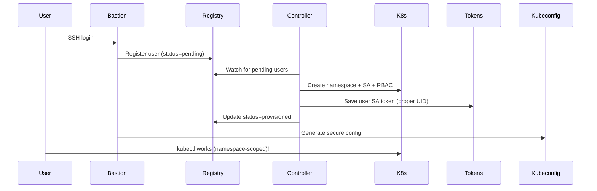

# Kubernetes Operator for PyTorch Development Servers

## Project Overview
Build a Kubernetes operator to manage development servers for developers on AWS EKS, supporting both standalone development and distributed PyTorch training. Users access the platform through a centralized bastion server that provides a secure, audited interface to the Kubernetes cluster. The operator will be built using Ansible Operator SDK and integrated with Kueue for resource quotas.

## Core Requirements

### Infrastructure
- **Platform**: AWS EKS
- **Operator Framework**: Ansible Operator SDK
- **Resource Management**: Kueue for quotas
- **Access Method**: Centralized bastion server with SSH access
- **Storage**:
  - EBS volumes for persistent user home directories (`/home/dev/`)
  - EFS shared volume across user's servers (`/shared`)
- **ML Framework**: PyTorch only

### Key Features
1. **Resource Flavors**: Predefined configurations (GPU types, memory, CPU)
2. **Distributed Training**: Support PyTorch distributed training with multiple replicas
3. **Lifecycle Management**: Create, update, delete, auto-shutdown
4. **User Isolation**: Per-user namespaces with RBAC
5. **Persistent Storage**: Home directories preserved across restarts

## Architecture Design

### Bastion Server Access

Users access the development server platform through a centralized bastion server:

- **SSH Entry Point**: Users SSH to `bastion.devservers.company.com`
- **Python CLI**: The `devctl` CLI is pre-installed on the bastion server
- **Namespace Isolation**: Each user is automatically scoped to their `dev-<username>` namespace
- **Secure kubectl Access**: Users receive namespace-scoped kubectl credentials (limited permissions)
- **Audit Trail**: All commands are logged centrally for security and compliance

```bash
# User workflow
ssh username@bastion.devservers.company.com
devctl create mydev gpu-large
devctl ssh mydev

# Users also have secure kubectl access
kubectl get pods -n dev-username    # ✅ Works - user's namespace
kubectl create namespace test       # ❌ Forbidden - security enforced
```

**Security Benefits:**
- Single point of access control
- Namespace-scoped kubectl credentials (limited to `dev-<username>`)
- Centralized command auditing
- Network isolation of development servers
- Automated user namespace management
- Zero-trust security model (users cannot escalate privileges)

### Custom Resource Definitions (CRDs)

#### DevServer CRD
```yaml
apiVersion: devservers.io/v1
kind: DevServer
metadata:
  name: <server-name>
  namespace: dev-<username>
spec:
  owner: <user>@company.com
  flavor: gpu-large  # References DevServerFlavor
  image: company/pytorch-dev:latest
  mode: standalone  # or distributed

  # For distributed training only
  distributed:
    worldSize: 4
    nprocsPerNode: 1
    backend: nccl
    ncclSettings:
      NCCL_DEBUG: INFO
      NCCL_SOCKET_IFNAME: eth0

  persistentHomeSize: 100Gi
  sharedVolumeClaimName: <username>-shared-efs
  enableSSH: true

  lifecycle:
    idleTimeout: 3600
    autoShutdown: true
```

#### DevServerFlavor CRD
```yaml
apiVersion: devservers.io/v1
kind: DevServerFlavor
metadata:
  name: gpu-large
spec:
  resources:
    requests:
      memory: 32Gi
      cpu: 8
      nvidia.com/gpu: 1
    limits:
      memory: 64Gi
      cpu: 16
      nvidia.com/gpu: 1
  nodeSelector:
    instance-type: g4dn.xlarge
```

### Kubernetes Resources Created

#### For Standalone Mode
- **Pod/Deployment**: Single development server
- **PVC (EBS)**: Home directory
- **PVC (EFS)**: Shared volume
- **Service**: For SSH/port access

#### For Distributed Mode
- **StatefulSet**: Ordered pods for training nodes
- **Headless Service**: Pod discovery for PyTorch
- **ConfigMap**: PyTorch utility scripts
- **PVC (EBS)**: Home directory per pod
- **PVC (EFS)**: Shared volume across all pods

## Phase 2 Architecture: Secure User Provisioning

### User Controller Sidecar Pattern

Phase 2 implements a secure user provisioning system using a sidecar controller pattern:

```yaml
apiVersion: apps/v1
kind: Deployment
metadata:
  name: bastion
spec:
  template:
    spec:
      containers:
      - name: bastion           # SSH server + user registration
        image: devserver/bastion:phase2
        volumeMounts:
        - name: shared-data
          mountPath: /shared
      
      - name: user-controller   # Secure resource provisioning
        image: devserver/bastion:phase2
        command: ["python3", "/usr/local/bin/user-controller.py"]
        volumeMounts:
        - name: shared-data
          mountPath: /shared
      
      volumes:
      - name: shared-data
        emptyDir: {}
```

### Security Model

**Controller Permissions (Elevated)**:
- Create namespaces (restricted to `dev-*` pattern)
- Create ServiceAccounts and RBAC roles
- Generate user tokens

**User Permissions (Limited)**:
- Access only their `dev-<username>` namespace
- Manage pods, services, PVCs within their namespace
- **Cannot** create namespaces or access cluster-wide resources

### User Provisioning Flow



### Resources Created Per User

**Namespace**: `dev-<username>`
```yaml
apiVersion: v1
kind: Namespace
metadata:
  name: dev-<username>
  labels:
    devserver.io/user: "<username>"
    devserver.io/created-by: "user-controller"
```

**ServiceAccount**: `user-<username>`
```yaml
apiVersion: v1
kind: ServiceAccount
metadata:
  name: user-<username>
  namespace: dev-<username>
```

**Role**: Namespace-scoped permissions
```yaml
apiVersion: rbac.authorization.k8s.io/v1
kind: Role
metadata:
  name: dev-user
  namespace: dev-<username>
rules:
- apiGroups: [""]
  resources: ["pods", "services", "persistentvolumeclaims", "configmaps", "secrets"]
  verbs: ["get", "list", "create", "update", "patch", "delete"]
- apiGroups: ["apps"]
  resources: ["deployments", "statefulsets", "replicasets"]
  verbs: ["get", "list", "create", "update", "patch", "delete"]
```

**User Kubeconfig**: Secure, namespace-scoped access
```yaml
apiVersion: v1
kind: Config
contexts:
- context:
    cluster: default-cluster
    namespace: dev-<username>
    user: user-<username>
users:
- name: user-<username>
  user:
    tokenFile: /shared/user-tokens/<username>/token  # User-owned file
```

## Implementation Plan

### Phase 1: Bastion Infrastructure ✅ COMPLETED
**Status**: All objectives completed successfully with enhanced automation

**Completed Deliverables**:
1. ✅ Build bastion container image with Python CLI (`devctl`)
2. ✅ Deploy bastion server with HA configuration (2 replicas)
3. ✅ Setup SSH authentication and user management (with auto-generated demo keys)
4. ✅ Configure Network Load Balancer and DNS (AWS NLB support + local port-forward)
5. ✅ Test user onboarding and basic CLI access (full end-to-end testing)

**Additional Achievements**:
- ✅ Environment-aware deployment (k3d, kind, minikube, EKS auto-detection)
- ✅ Automated SSH key generation and injection for testing
- ✅ Cross-platform compatibility (macOS/Linux)
- ✅ Automated cleanup and deployment workflows
- ✅ Comprehensive error handling and troubleshooting
- ✅ Repeatable developer experience with one-command workflow

### Phase 2: Secure User Provisioning ✅ COMPLETED
**Status**: All objectives completed successfully with enhanced security model

**Completed Deliverables**:
1. ✅ User Controller Sidecar - Automatic namespace and ServiceAccount provisioning
2. ✅ Secure kubectl Access - Users get namespace-scoped credentials (no cluster access)
3. ✅ Zero-Trust Security Model - Users cannot create namespaces or access other namespaces
4. ✅ Enhanced CLI - Security-appropriate connectivity tests and Phase 2 capabilities
5. ✅ Comprehensive Testing - Full end-to-end validation with timeout handling

**Security Architecture Implemented**:
- ✅ **Separated RBAC**: Controller SA (cluster permissions) vs User SA (namespace-scoped)
- ✅ **Automatic User Provisioning**: `dev-<username>` namespace + `user-<username>` ServiceAccount
- ✅ **Token Permission Fix**: User-owned token files with proper UID ownership
- ✅ **Namespace Isolation**: Users can only access their own development namespace
- ✅ **Sidecar Pattern**: User controller runs alongside bastion for secure provisioning

**Technical Implementation**:
- ✅ User Controller Python sidecar container
- ✅ Shared volume communication between bastion and controller
- ✅ User registry JSON tracking and status management
- ✅ Enhanced entrypoint with user registration and secure kubeconfig generation
- ✅ Security-aware devctl CLI with proper connectivity testing

### Phase 3: DevServer Operator & CRDs (Weeks 5-6)
1. Setup Ansible Operator SDK project structure
2. Create basic CRDs (DevServer, DevServerFlavor)
3. Implement standalone server creation/deletion
4. EBS/EFS volume provisioning
5. Integrate operator with bastion CLI

### Phase 4: Distributed Training (Weeks 7-8)
1. Add distributed mode to DevServer CRD
2. Implement StatefulSet creation for distributed training
3. Configure PyTorch environment variables
4. Add headless service for pod discovery
5. Create PyTorch utility scripts ConfigMap

### Phase 5: Resource Management (Weeks 9-10)
1. Integrate Kueue for resource quotas
2. Implement gang scheduling for distributed jobs
3. Add resource monitoring and cost tracking
4. Auto-shutdown for idle servers
5. Capacity planning dashboards

### Phase 6: Production Readiness (Weeks 11-12)
1. Add comprehensive error handling
2. Implement health checks and recovery
3. Setup logging and monitoring (Prometheus/Grafana)
4. Security hardening and penetration testing
5. Documentation and training materials

## Project Structure

```
devserver/                 # ✅ Phase 1 & 2 COMPLETED
├── bastion/               # ✅ Phase 2 - Secure User Provisioning
│   ├── Dockerfile          # Multi-stage container (Phase 2: SSH + user-controller)
│   ├── entrypoint.sh       # Enhanced: User registration + secure kubeconfig
│   ├── user-controller.py  # ✅ NEW - Sidecar for secure resource provisioning
│   ├── config/
│   │   ├── motd           # Welcome message
│   │   ├── sshd_config    # SSH security hardening
│   │   └── profile.d/
│   │       └── devserver.sh # User environment setup
│   └── k8s/               # Phase 2 - Enhanced Kubernetes manifests
│       ├── namespace.yaml  # Isolated namespace
│       ├── rbac.yaml      # ✅ UPDATED - Separated controller vs user permissions
│       ├── deployment.yaml # ✅ UPDATED - Sidecar pattern (bastion + user-controller)
│       └── service.yaml   # LoadBalancer with AWS NLB annotations
├── cli/                   # ✅ Phase 2 - Enhanced Python CLI
│   ├── devctl/
│   │   ├── main.py        # ✅ UPDATED - Security-aware connectivity tests
│   │   └── __init__.py
│   └── pyproject.toml     # Modern Python packaging
├── scripts/               # ✅ Phase 2 - Enhanced automation
│   ├── build-bastion.sh   # ✅ UPDATED - Phase 2 container build
│   ├── deploy-bastion.sh  # ✅ UPDATED - Phase 2 deployment
│   └── test-ssh.sh        # ✅ UPDATED - Comprehensive Phase 2 security testing
├── demo-keys/             # ✅ Auto-generated SSH keys for testing
├── CLAUDE.md              # ✅ UPDATED - Phase 2 architecture documentation
└── README.md

# Future Phases (Planned):
pytorch-dev-operator/      # Phase 3+ - DevServer CRDs and Operator
├── config/
│   ├── crd/
│   │   ├── devserver_crd.yaml
│   │   └── devserverflavor_crd.yaml
│   ├── rbac/
│   │   ├── role.yaml
│   │   └── role_binding.yaml
│   └── manager/
│       └── kustomization.yaml
├── roles/
│   └── devserver/
│       ├── tasks/
│       │   ├── main.yml
│       │   ├── create_standalone.yml
│       │   ├── create_distributed.yml
│       │   ├── delete.yml
│       │   └── update.yml
│       ├── templates/
│       │   ├── deployment.yaml.j2
│       │   ├── statefulset-pytorch.yaml.j2
│       │   ├── pvc-home.yaml.j2
│       │   ├── pvc-shared.yaml.j2
│       │   ├── service.yaml.j2
│       │   ├── service-headless.yaml.j2
│       │   └── configmap-pytorch-utils.yaml.j2
│       └── defaults/
│           └── main.yml
├── watches.yaml
├── requirements.yml
└── Dockerfile             # Operator image
```

## Phase 1 Implementation Summary

### What We Built ✅

**Complete Bastion Infrastructure**:
- SSH-accessible Ubuntu 22.04 container with OpenSSH hardening
- DevCtl CLI package installed via pip with proper pyproject.toml
- Kubernetes connectivity with service account and RBAC
- High availability deployment with 2 replicas and anti-affinity rules
- Health checks and readiness probes for production reliability

**Smart Deployment Automation**:
- Environment detection (k3d, kind, minikube, EKS) with appropriate handling
- Automatic SSH key generation for immediate testing
- Image loading for local clusters (k3d image import, kind load, etc.)
- Dynamic deployment patching (imagePullPolicy based on cluster type)
- Automated cleanup of existing resources before deployment

**Developer Experience**:
- One-command workflow: `build-bastion.sh` → `deploy-bastion.sh` → `test-ssh.sh`
- Auto-generated SSH keys stored in `.demo-keys/` for immediate testing
- End-to-end testing that validates SSH auth and CLI functionality
- Cross-platform compatibility (macOS/Linux) with proper error handling

**Production Ready Features**:
- AWS Network Load Balancer support with health check configuration
- Service account with minimal required permissions
- SSH security hardening and proper user environment setup
- Container security context properly configured for SSH daemon

### Phase 2 Implementation Summary

### What We Built ✅

**Secure User Provisioning Architecture**:
- User Controller sidecar for automatic namespace and ServiceAccount provisioning
- Separated RBAC model (controller vs user permissions)
- Secure token management with proper file ownership
- Enhanced CLI with security-appropriate connectivity tests
- Comprehensive end-to-end testing with timeout handling

**Security Model Achieved**:
- Zero-trust architecture: Users cannot escalate privileges
- Namespace isolation: Users limited to `dev-<username>` scope
- Automatic resource provisioning without manual intervention
- Audit trail through user registry and centralized logging

**Production Ready Features**:
- Resilient sidecar pattern with health checks
- Token permission fixes for multi-user scenarios
- Enhanced error handling and timeout management
- Cross-platform compatibility with environment detection

### Ready for Phase 3 🚀

The **secure user provisioning** is complete and provides:
- Production-ready bastion with automatic user onboarding
- Secure kubectl access with proper namespace isolation
- Proven sidecar controller pattern for resource management
- Enhanced CLI framework ready for DevServer CRD integration
- Comprehensive security model validated through testing

## CLI Commands

### Phase 2 Available Commands ✅

Users access the Python CLI through the bastion server via SSH:

```bash
# SSH to bastion server
ssh username@bastion.devservers.company.com

# Phase 2 - CLI is pre-installed and configured
devctl status        # Show environment status and kubectl connectivity
devctl info         # Show available commands and capabilities  
devctl test-k8s     # Test secure Kubernetes access and permissions
devctl --help       # Detailed help

# Phase 2 - Users also have secure kubectl access
kubectl get pods -n dev-username     # ✅ Works - user's namespace
kubectl create pod test -n dev-username  # ✅ Works - user can manage resources
kubectl get pods -n kube-system     # ❌ Forbidden - security enforced
kubectl create namespace test       # ❌ Forbidden - security enforced
```

### Phase 3 Planned Commands (DevServer Operator)

```bash
# Future Phase 3 commands (coming with DevServer CRDs)
devctl create my-dev --flavor gpu-large
devctl create training-job --flavor gpu-large --distributed --replicas 4
devctl ssh my-dev [--replica 0]
devctl run training-job train.py --batch-size 32
devctl monitor training-job
devctl delete my-dev
```

## Key Technical Decisions

### Storage Strategy
- **EBS** for home directories: Better performance, per-pod isolation
- **EFS** for shared data: Dataset sharing, checkpoints, code
- **EmptyDir** with Memory medium for `/dev/shm`: Critical for PyTorch DataLoader performance

### Networking
- **Headless Service** for PyTorch distributed discovery
- **NCCL** environment variables properly configured
- Port range 29500-29510 reserved for distributed communication

### PyTorch Optimizations
- Single GPU per pod for simplicity (can be extended)
- Proper RANK/WORLD_SIZE environment variables
- NCCL backend for GPU communication
- Utility scripts for easy `torchrun` usage

### Security & Access
- Per-user namespaces for isolation
- RBAC for user permissions
- Optional SSH access for development
- Service accounts for CLI authentication

## Success Metrics
- Bastion server availability > 99.9%
- SSH connection time to bastion < 2 seconds
- Server creation time < 2 minutes
- Support 100+ concurrent users on bastion
- Support 100+ concurrent dev servers
- 99% uptime for persistent storage
- Distributed training setup < 5 minutes
- Cost reduction via auto-shutdown > 30%
- Zero direct kubectl access for end users

## Future Enhancements
- Web UI dashboard
- VS Code remote development integration
- Jupyter notebook support
- Automated checkpoint management
- Multi-GPU per pod support
- Spot instance support for cost optimization
- Integration with MLflow/Weights & Biases

## Dependencies
- AWS EKS cluster with GPU nodes
- Network Load Balancer for bastion access
- EBS CSI driver
- EFS CSI driver
- Kueue installed
- Ansible Operator SDK
- NVIDIA device plugin
- Container registry for PyTorch and bastion images
- DNS management for bastion endpoint
- SSH key management system (GitHub/LDAP/IAM)

## Next Steps
1. Set up development EKS cluster with GPU nodes
2. Build and deploy bastion infrastructure (Phase 1)
3. Setup DNS and user SSH access
4. Implement basic operator and CLI integration (Phase 2)
5. Test with pilot user group
6. Iterate based on feedback and expand features
