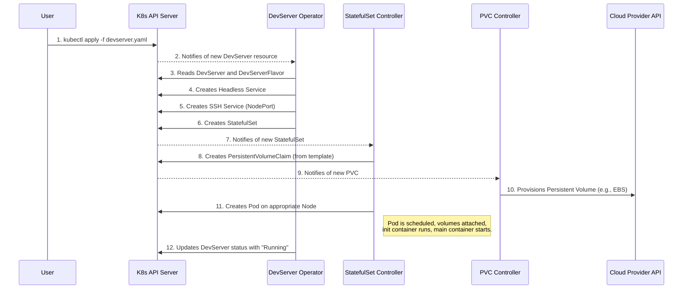

# DevServer Operator

This document provides a technical overview of the DevServer Operator, its components, and its architecture.

## How it Works: The Operator Pattern

This operator follows the standard Kubernetes operator pattern. It extends the Kubernetes API with custom resources and uses a controller to manage the lifecycle of those resources.

### Core Components

1.  **`DevServer` CRD**: A custom resource that defines the desired state of a development environment. This is the primary resource users interact with. It specifies details like the owner, flavor, SSH key, and storage requirements.

2.  **`DevServerFlavor` CRD**: A cluster-scoped custom resource that defines a "t-shirt size" for a `DevServer`. It specifies the compute resources (CPU, memory, GPU) and any node selectors required for scheduling.

3.  **Operator Controller**: The Python code running in the cluster that watches for changes to `DevServer` resources. When a `DevServer` is created, updated, or deleted, the controller takes action to make the actual state of the cluster match the desired state defined in the resource.

### Creation Workflow

The following diagram illustrates what happens when a user creates a new `DevServer`:



In summary, the user declaratively defines *what* they want, and the operator is responsible for the imperative steps of figuring out *how* to achieve that state by creating and managing the underlying Kubernetes resources.

---

# DevServer Operator Storage Configuration

The DevServer Operator is designed to be cloud-agnostic. It does not contain any code specific to AWS, GCP, or any other cloud provider. Instead, it relies on standard Kubernetes storage abstractions: `StorageClass`, `PersistentVolume` (PV), and `PersistentVolumeClaim` (PVC).

This document provides examples of how a cluster administrator can configure storage on specific cloud providers to work with the operator.

---

## 1. User Home Directories (Block Storage)

Each `DevServer` gets a dedicated home directory (`/home/dev`) using a `PersistentVolumeClaim` created from the `StatefulSet`'s `volumeClaimTemplates`. To make this work, the cluster must have a default `StorageClass` that can dynamically provision block storage.

### Example: AWS EBS

On an AWS EKS cluster, you need a `StorageClass` that uses the `ebs.csi.aws.com` provisioner.

1.  **Ensure the AWS EBS CSI Driver is installed in your cluster.** It is installed by default on recent EKS versions.

2.  **Create a `StorageClass` YAML file:**

    ```yaml
    # storageclass-ebs.yaml
    apiVersion: storage.k8s.io/v1
    kind: StorageClass
    metadata:
      name: ebs-sc
      annotations:
        storageclass.kubernetes.io/is-default-class: "true"
    provisioner: ebs.csi.aws.com
    volumeBindingMode: WaitForFirstConsumer
    parameters:
      type: gp3 # General Purpose SSD (default)
    ```
    *   The `is-default-class` annotation is critical. It tells Kubernetes to use this `StorageClass` for any PVC that doesn't explicitly request a different one.

3.  **Apply it to your cluster:**
    ```bash
    kubectl apply -f storageclass-ebs.yaml
    ```

With this in place, when a user creates a `DevServer`, the operator's request for storage will be automatically fulfilled by a new AWS EBS volume.

---

## 2. Shared Storage (File Storage)

The operator can mount a shared, `ReadWriteMany` volume at `/shared`. This is ideal for datasets, dotfiles, or collaboration. This pattern uses a pre-existing `PersistentVolumeClaim`.

### Example: AWS EFS

For EFS, the administrator provisions the filesystem and makes it available to the cluster.

1.  **Provision the EFS Filesystem.** This can be done via the AWS Console or Terraform. You will need the **File System ID** (e.g., `fs-12345678`).

2.  **Ensure the AWS EFS CSI Driver is installed in your cluster.**

3.  **Create a `PersistentVolume` (PV) and `PersistentVolumeClaim` (PVC):**

    Create a YAML file that defines both the PV (which points to the EFS filesystem) and the PVC (which makes it available for pods to claim).

    ```yaml
    # efs-pvc.yaml
    apiVersion: v1
    kind: PersistentVolume
    metadata:
      name: efs-shared-volume
    spec:
      capacity:
        storage: 5Pi # Capacity is nominal for EFS
      volumeMode: Filesystem
      accessModes:
        - ReadWriteMany
      persistentVolumeReclaimPolicy: Retain
      csi:
        driver: efs.csi.aws.com
        volumeHandle: fs-12345678 # <-- Your EFS File System ID here
    ---
    apiVersion: v1
    kind: PersistentVolumeClaim
    metadata:
      name: efs-shared-claim
      # This PVC should be in the same namespace where DevServers will be created
      namespace: default 
    spec:
      accessModes:
        - ReadWriteMany
      storageClassName: "" # Important: Direct binding to the PV
      volumeName: efs-shared-volume
      resources:
        requests:
          storage: 5Pi
    ```

4.  **Apply it to your cluster:**
    ```bash
    kubectl apply -f efs-pvc.yaml
    ```

---

## 3. Consuming Storage in a `DevServer`

Once the administrator has configured the cluster's storage, users can create `DevServer` resources that consume it.

```yaml
apiVersion: devserver.io/v1
kind: DevServer
metadata:
  name: my-dev-server
spec:
  owner: user@example.com
  flavor: gpu-large
  ssh:
    publicKey: "ssh-rsa AAAA..."

  # This will use the default StorageClass (EBS in our example)
  # to provision a 100Gi home directory.
  persistentHomeSize: 100Gi

  # This will mount the existing PVC backed by EFS
  # into the dev server at /shared.
  sharedVolumeClaimName: efs-shared-claim
```
